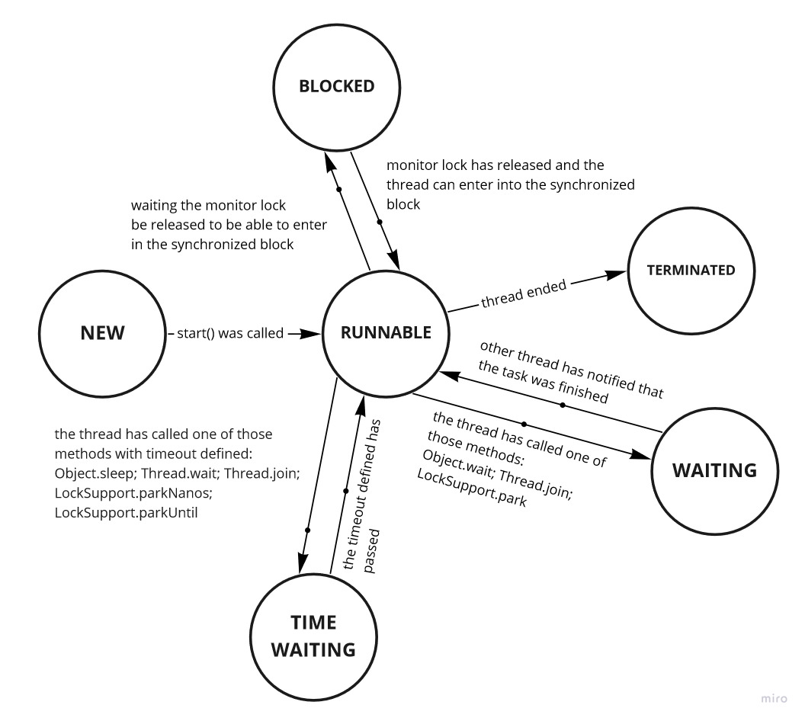

For that answer, we'll consider all states that a Thread in Java can be at any time of his life. Bellow a image containing all states represented as circles and events (what makes a state transition to another one) as arrows.

